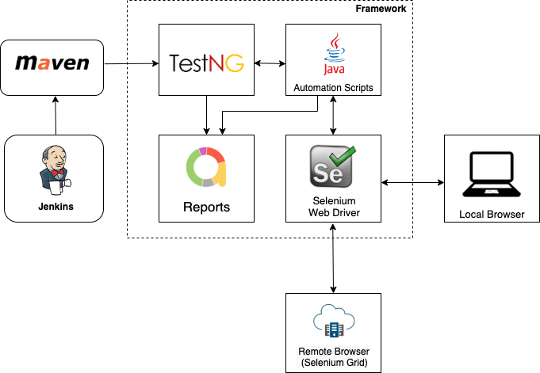

# WebAutomation Framework

Purpose: This project is meant for automating UI/Web test cases.

##  Prerequisites
* [JAVA](https://docs.oracle.com/en/java/javase/15/install/installation-jdk-macos.html#GUID-E8A251B6-D9A9-4276-ABC8-CC0DAD62EA33) - version 8 and above.
* [MAVEN](http://maven.apache.org/install.html)- version 3.6.0 and above
* [Chrome](https://www.google.com/intl/en_in/chrome/)/[Firefox](https://www.mozilla.org/en-US/firefox/new/)
* [Allure](https://docs.qameta.io/allure/#_mac_os_x) - optional for viewing allure reports

## Framework Architecture



## How to run?
#### To run via IDE 
* Make sure TestNG plugin is installed in your IDE
* Make sure **config.properties** has correct values
    
#### To run using TestNG XML files, inside **/suites** folder.
Optional parameters which can be passed in XML files

```<parameter name="{param-name}" value="{param-value}"></parameter>```

| param-name    | Description |
| :------------ | :----------- |
| url            | Base URL to start test cases    |
| browser        | Currently supported browsers - **chrome**, **firefox**, **mobileView**     |
| retryFailed    | If set to true, failed test cases will be retried     |
| maxRetryCount  | Number of times the failed test cases will be re-run. Default value is 2.Only applicable when **retryFailed** is true    |

#### To run via maven

* Few maven properties(systemPropertyVariables) could be passed via maven Properties
* Optional properties supported

| properties   | Description   |
| -----------  | -----------   |
| url          | URL of website under test. It must start with either http:// or https://    |
| browser      | Currently supported browsers - **chrome**, **firefox**, **mobileView**    |
| suiteFile    | To run any testNG suites files which are under folder **suites**. Please note default file set to run is **qa-regression.xml**   | 
| retryFailed  | If set to true, failed test cases will be retried    |
|maxRetryCount | Number of times the failed test cases will be re-run. Default value is 2.Only applicable when **retryFailed** is true   |
  
  - Example:      
```
  mvn clean install -Dbrowser=mobileView -DretryFailed=true -DsuiteFile=suites/qa-regression.xml
```

##### Priority for Framework properties/argument/parameter
1. Maven properties
2. TestNG paramaters
3. Values passed in **config.properties** file

## Reports
#### Two types of reports available 
1. **Extension Report**
    * *This will auto-generated after run from below -*
		* IDE
		* XML Files
		* Maven
> 	Should be found under project with **AppName** provided in config file, with *HTML* extension

2. **Allure Report**
    * This can be generated only after the test cases run is completed via maven
    * Allure installation is mandatory
    * To generate allure report use below command once maven is completed
    ```
    allure serve
    ```
##  Logs and Images
* For each execution it will create a new log file under logs folder
* The format for log is simple AppName (in config file) + time format provided in Constant class + .log
    * Default value provided "MM-dd-yyyy_hh.mm.ss"
    * ex:- ```walletHub14-07-2021_08.51.02.log```
* All failure images will be saved under logs/images folder
    * Unique identifier for files while saving
    * All failure images will be auto-saved to Reports

#### Code Style

Please use [google/styleguide](https://github.com/google/styleguide/blob/gh-pages/intellij-java-google-style.xml) for this project.
